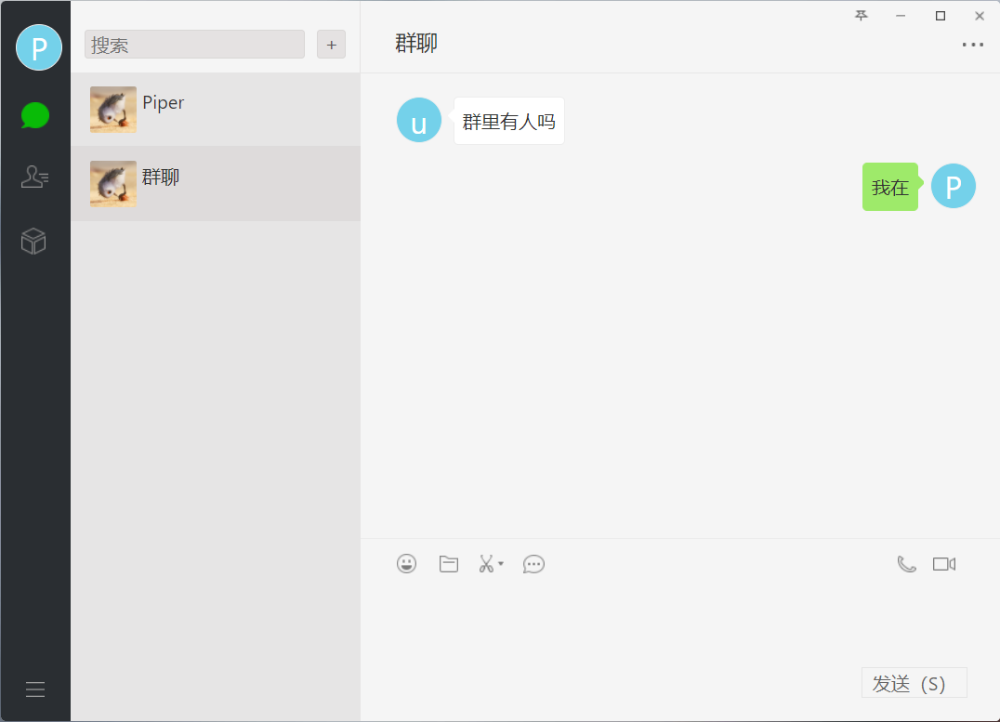

# PiperChat

#### 介绍

PiperChat 是一款简洁高效的即时通讯服务，提供多种技术供开发者选择，帮助开发者快速构建高并发的即时通讯服务。
项目目标是做一款通用的即时通讯服务，可以适应目前市面大部分通讯场景。
希望各位开发者能够提出自己的见解和解决方案进行集成。欢迎评论 提Issues。

#### 软件架构

- common (公共组件)
- spring-server (开发效率高的web服务)
- web-server (性能高的web服务)
- undertow-im (使用jsr规范的长连接服务)
- netty-im (使用netty的长连接服务)
- client (一个简单的客户端)

#### 安装教程

1. 先行安装好项目依赖软件(redis,mysql)
2. root模块执行 mvn clean install
3. 拿到各个服务的jar包 执行 java -jar

#### 参与贡献

1. Fork 本仓库
2. 新建 Feat_xxx 分支
3. 提交代码
4. 新建 Pull Request
