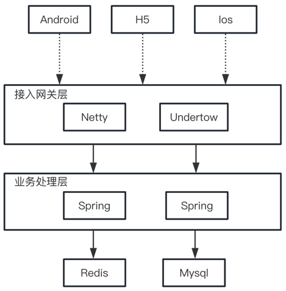

# PiperChat

#### 介绍

PiperChat 是一款简洁高效的即时通讯服务，提供多种技术供开发者选择，帮助开发者快速构建高并发的即时通讯服务。
项目目标是做一款通用的即时通讯服务，可以适应目前市面大部分通讯场景。
希望各位开发者能够提出自己的见解和解决方案进行集成。欢迎评论 提Issues。

#### 软件架构

#### 目录结构

- common (公共组件)
- spring-server (PiperChat 服务)
- undertow-im (Undertow开发的长连接服务)
- netty-im (Netty开发的长连接服务)
- client (一个简单的测试客户端)
- http://wstool.js.org/ (Websocket在线测试)

#### 启动步骤

1. 安装并启动Redis
2. 安装并启动Mysql（本地测试不用）
3. 修改各个服务中Redis、Mysql的配置
4. root模块执行 mvn clean install
5. 拿到各个服务的jar包 执行 java -jar

#### 参与贡献

1. clone 本仓库
2. 新建 feat_xxx 分支
3. 提交代码
4. 新建 Pull Request
